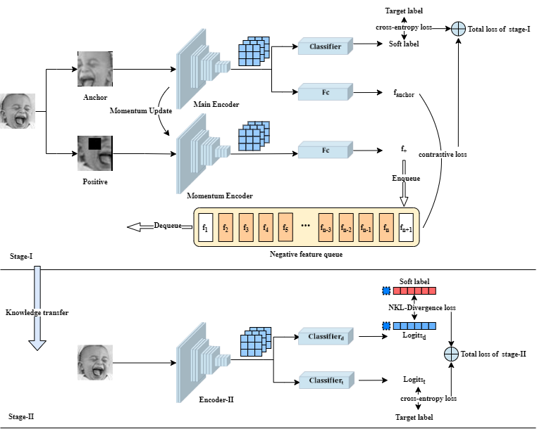

### CLND

#### Contrastive Learning Distillation of Non-target categories for Facial Expression Recognition 

This is a PyTorch implementation of the paper *"Contrastive Learning Distillation of Non-target Categories for Facial Expression Recognition."* The overall framework is shown in the Figure above.

Before running this repository, you should store the dataset in the folder *"data"* according to the specified format.

- Stage-I: *joint training using contrastive learning and supervised learning*

  `python cldn_stage_i.py --data=[your data folder name]` 

- Stage-II: *Self-distillation with Non-target categories KL-Divergence loss*

  `python cldn_stage_ii.py --teacher_ckpt=[your checkpoints path] --data=[you data folder name] `

